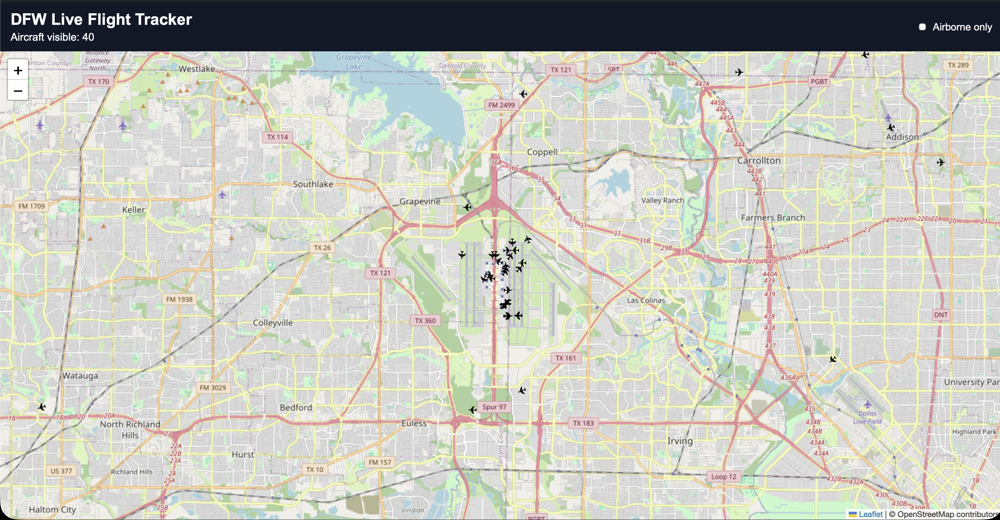

# ✈️ DFW Flight Tracker
## Live Map Preview


A full-stack aviation tracking application that displays live aircraft around the Dallas–Fort Worth area on an interactive map.

## Overview

This project pulls live aircraft position data from the OpenSky API, processes it through a FastAPI backend, and displays aircraft on a React + Leaflet frontend. Aircraft are shown on a live map with position, heading, altitude, speed, and airborne status.

## Features

- Live aircraft map centered on the Dallas–Fort Worth area
- FastAPI backend for data processing
- React frontend with Leaflet map visualization
- Aircraft markers with heading-based orientation
- Airborne-only filtering
- Automatic refresh of live aircraft data
- PostgreSQL setup for future aircraft metadata enrichment

## Tech Stack

### Backend
- Python
- FastAPI
- PostgreSQL
- HTTPX
- Python dotenv

### Frontend
- React
- Vite
- Leaflet
- React Leaflet

## Project Structure

```text
flight-tracker/
├── backend/
│   ├── main.py
│   ├── init_db.py
│   └── .venv/
├── frontend/
│   ├── src/
│   ├── package.json
│   └── vite.config.js
├── .gitignore
└── README.md
